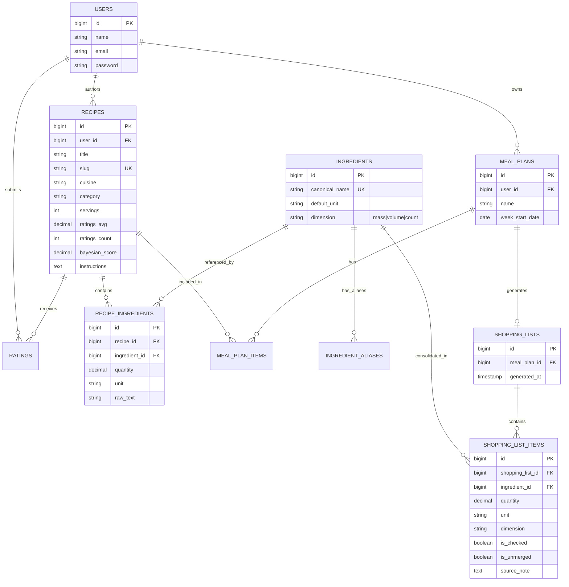

# Panchforon (পাঁচফোড়ন) — Full-Stack Recipe Platform & Intelligent Culinary Engine

[](https://laravel.com)
[](https://php.net)
[](https://react.dev)
[](https://www.typescriptlang.org/)
[](https://tailwindcss.com)
[](https://pestphp.com)
[](https://www.w3.org/WAI/WCAG21/quickref/)
[](https://www.mysql.com/)

> **Panchforon** is an enterprise-grade, full-stack culinary engineering application inspired by the historic Bengali five-spice blend (*Radhuni/Mustard, Fenugreek, Nigella, Cumin, and Fennel*). It combines an **editorial storefront design** with two complex computational engines: a **dimension-aware grocery consolidation engine** and a **Bayesian quality ranking algorithm** for community recipe ratings.

---

## 🌟 Quick Evaluation Credentials

To immediately test the application with a pre-loaded weekly meal plan and an active consolidated grocery list:

| Role | Email | Password | Quick Action |
| :--- | :--- | :--- | :--- |
| **Reviewer / Demo** | `demo@panchforon.com` | `password` | Use the **"1-Click Demo Login"** button on the navbar or home page hero |

---

## 📑 Table of Contents

1. [Key Features & User Journey](#-key-features--user-journey)
2. [Engineering Deep Dives](#-engineering-deep-dives)
   - [1. Dimension-Aware Grocery Merge Engine (`MergeEngine`)](#1-dimension-aware-grocery-merge-engine-mergeengine)
   - [2. Bayesian Quality Ranking Engine (`RankingService`)](#2-bayesian-quality-ranking-engine-rankingservice)
   - [3. Editorial Storefront Design System (Pivoo-Inspired UI/UX)](#3-editorial-storefront-design-system-pivoo-inspired-uiux)
   - [4. Pure Decoupled Domain Architecture (Clean Architecture)](#4-pure-decoupled-domain-architecture-clean-architecture)
   - [5. Resilient External Recipe Ingestion Pipeline (`MealDbImporter`)](#5-resilient-external-recipe-ingestion-pipeline-mealdbimporter)
3. [System Architecture](#-system-architecture)
4. [Database Entity Relationship Diagram](#-database-entity-relationship-diagram)
5. [Technology Stack](#-technology-stack)
6. [REST API Specification](#-rest-api-specification)
7. [Installation & Setup](#-installation--setup)
8. [Testing & Quality Verification](#-testing--quality-verification)

---

## 🚀 Key Features & User Journey


- **Editorial Recipe Directory:** Browse hundreds of regional South Asian, Middle Eastern, and international recipes categorized by culinary heritage, prep time, and difficulty.
- **Dynamic Portions & Yield Scaling:** Adjust servings directly on the recipe view; ingredient quantities, conversions, and cooking notes scale instantaneously.
- **Weekly Meal Planner:** Add multiple dishes to a customized weekly calendar plan with independent portion multipliers per meal.
- **Intelligent Dimension-Safe Merging:** One click turns the week's chosen recipes into a single consolidated shopping list—preventing accidental duplicate purchases while strictly isolating physical measurement dimensions.
- **Interactive Checklists & Physical Print Mode:** Check off items as you navigate supermarket aisles, or generate a formatted paper-ready checklist using `@media print` CSS optimization.
- **Community Reviews & Bayesian Scores:** Rate and review dishes using a verified Bayesian shrinkage formula that prevents single-review bias.

---

## 🔬 Engineering Deep Dives

### 1. Dimension-Aware Grocery Merge Engine (`MergeEngine`)

Combining ingredients across multiple diverse recipes is a notoriously deceptively complex computational problem. Standard naive approaches concatenate or sum raw numbers, leading to fatal arithmetic failures:

$$\text{Naive Arithmetic Failure:}\quad 250\text{g chicken} + 2\text{ chicken breasts} \neq 252\text{ ???}$$

#### A. Strict Dimension Isolation Taxonomy
The Panchforon `MergeEngine` enforces strict **physical dimensional boundary isolation**. Quantities are categorized into one of three incompatible dimension buckets:

| Dimension | Supported Units | Canonical Base | Behavior |
| :--- | :--- | :--- | :--- |
| **Mass / Weight** | `kg`, `g`, `mg`, `oz`, `lb` | `g` (Grams) | Converted to grams, summed with servings multiplier, converted back to optimal display unit (`kg` if $\ge 1000\text{g}$, else `g`). |
| **Volume / Liquid** | `l`, `ml`, `cup`, `tbsp`, `tsp`, `fl oz` | `ml` (Millilitres) | Converted to millilitres using volumetric multipliers ($1\text{ cup} = 240\text{ml}$, $1\text{ tbsp} = 15\text{ml}$, $1\text{ tsp} = 5\text{ml}$), consolidated, and formatted. |
| **Discrete Counts** | `piece`, `clove`, `bunch`, `pinch`, `slice`, `can` | `count` (Units) | Whole items are summed and passed through a **ceiling safety rounder** ($\lceil 2.3 \rceil \rightarrow 3$) so cooks never face shortages. |
| **Qualitative / Unmerged** | *“to taste”*, *“for frying”*, unparseable | `none` | **Never arithmetically combined**. Kept as distinct lines with recipe attribution tags to preserve qualitative nuance. |

> **Architectural Decision:** We chose to intentionally **under-merge** rather than guess cross-dimensional conversions without density metadata (e.g. 1 cup of chopped onion vs. 100g of onion).

#### B. Deterministic Alias Resolution
Ingredient identity mapping does not rely on fragile fuzzy string matching. Instead, the engine utilizes a deterministic database vocabulary table (`ingredient_aliases`):
- `cilantro` $\leftrightarrow$ `coriander` $\rightarrow$ Canonical: *Coriander Leaves*
- `aubergine` $\leftrightarrow$ `eggplant` $\leftrightarrow$ `brinjal` $\leftrightarrow$ `begun (বেগুন)` $\rightarrow$ Canonical: *Eggplant*
- `peyaj (পেঁয়াজ)` $\rightarrow$ Canonical: *Onion*
- `ada (আদা)` $\rightarrow$ Canonical: *Ginger*

#### C. Fractional & Vulgar String Normalization
Before calculation, raw text quantities undergo rigorous normalization handling mixed fractions (`1 1/2`), vulgar Unicode fractions (`½` $\rightarrow 0.5$, `¼` $\rightarrow 0.25$, `¾` $\rightarrow 0.75$), and ranges (`2-3` $\rightarrow 3$ upper bound).

---

### 2. Bayesian Quality Ranking Engine (`RankingService`)

A fundamental flaw in community review platforms is **small-sample rating distortion**: a recipe with a single 5-star review (100% 5.0) ranks higher than an established community staple with 480 reviews averaging 4.8 stars.

To ensure mathematical fairness, Panchforon calculates a **Bayesian weighted average** (derived from the IMDB Bayesian shrinkage formulation):

$$\text{WR} = \left(\frac{v}{v + m}\right) R + \left(\frac{m}{v + m}\right) C$$

Where:
- $v$: Total number of ratings/reviews for the specific recipe.
- $R$: Arithmetic mean rating of the recipe ($\frac{\sum r_i}{v}$).
- $m$: Prior confidence threshold ($m = 10$). Recipes require at least 10 votes to pull significantly away from the global baseline.
- $C$: Global arithmetic mean across all rated recipes in the database ($C \approx 4.4$).

#### Concrete Ranking Comparison:

| Recipe Scenario | Raw Arithmetic Avg | Total Votes ($v$) | Bayesian Score | Community Directory Rank |
| :--- | :--- | :--- | :--- | :--- |
| **Brand New Recipe** | **5.0 ★** | 1 vote | **4.45 ★** | Lower (Anchored near community mean) |
| **Occasional Recipe** | **4.8 ★** | 5 votes | **4.53 ★** | Moderate (Early community validation) |
| **Community Masterpiece** | **4.75 ★** | 120 votes | **4.72 ★** | **Top Ranked** (Proven statistical confidence) |
| **Controversial Recipe** | **2.5 ★** | 35 votes | **2.92 ★** | Accurately penalized with high confidence |

- **Execution Cadence:** Recalculated synchronously whenever a user submits or edits a review, and synchronized nightly via Laravel's scheduled console command:
  ```bash
  php artisan recipes:recalculate-global-mean
  ```

---

### 3. Editorial Storefront Design System (Pivoo-Inspired UI/UX)

The user interface was built to evoke the visual polish of high-end international culinary publications (inspired by Pivoo Home Three):

```
Typography: Playfair Display (Serif Headlines) + Inter (Clean Modern Sans)
Palette:
  • Brand Primary:   #FC7100 (Pumpkin)     — High-contrast CTAs & active indicators
  • Brand Accent:    #FB8818 (UT Orange)   — Highlights & secondary accents
  • Brand Hot:       #F45F67 (Bright Pink) — Urgency, sales, destructive actions
  • Brand Success:   #5CA135 (Asparagus)   — In-stock states & checklist confirmations
  • Brand Surface:   #F5DDC2 (Almond)      — Warm editorial backgrounds
  • Ink / Contrast:  #1A1208 (Deep Ink)    — WCAG AA compliant text contrast (6.62:1)
```

- **Full-Bleed Responsive Layout:** Breaking free from narrow container boxes, the hero and interactive ribbons bleed edge-to-edge with ambient radial glows and a continuous animated spice marquee (`animate-marquee`).
- **WCAG AA Compliance:** Every button, chip, and badge strictly conforms to contrast ratios $\ge 4.5:1$ (Option A: `#1A1208` ink on `#FC7100` fill yields 6.62:1; Option B: `#FFFFFF` on derived dark shades `#BD5500`, `#CE0E18`, `#457928`).
- **Hardware-Accelerated Micro-Animations:** Zero-dependency, GPU-accelerated CSS keyframe animations for component entrances (`animate-fade-in`, `animate-slide-up`, `animate-scale-in`), gentle floating telemetry badges (`animate-float`), and smooth modal transitions.
- **Refined Architectural Radii:** Clean, modern `rounded-2xl` and `rounded-xl` geometries replacing excessive capsule radiuses.

---

### 4. Pure Decoupled Domain Architecture (Clean Architecture)

The core business logic of Panchforon is structured following Clean Architecture / Domain-Driven Design principles:

```
app/
├── Domain/
│   ├── DTOs/
│   │   ├── ParsedIngredient.php       ← Immutable input DTO
│   │   ├── ShoppingListLine.php       ← Calculated output DTO
│   │   └── RecipePlanItemInput.php    ← Meal plan input DTO
│   └── Services/
│       ├── MergeEngine.php            ← Pure PHP: Dimension & Unit Math
│       ├── RankingService.php         ← Pure PHP: Bayesian Mathematics
│       └── IngredientParser.php       ← Pure PHP: Regex & String Tokenizer
├── Http/Controllers/                  ← Thin HTTP adapters
├── Models/                            ← Thin Eloquent persistence entities
└── Console/Commands/                  ← Artisan workers & CLI pipelines
```

- **Zero Framework Coupling in Core Logic:** `MergeEngine`, `RankingService`, and `IngredientParser` have zero dependencies on Laravel, Eloquent, or HTTP request objects.
- **Deterministic Testability:** The entire merge engine and rating algorithm can be unit-tested in isolation in milliseconds without database queries, migrations, or mocked HTTP sessions.

---

### 5. Resilient External Recipe Ingestion Pipeline (`MealDbImporter`)

An idempotent ETL pipeline imports recipes from external sources (such as TheMealDB):
- Extracts ingredients and measurements from 20 numbered column pairs (`strIngredient1..20`, `strMeasure1..20`).
- Normalizes unicode fractions, removes unneeded descriptors, and maps names to canonical database keys.
- **Quarantine Path:** Unmapped ingredients are logged to `storage/logs/unresolved_ingredients.log` allowing continuous expansion of the alias dictionary without aborting active imports.

---

## 🏛 System Architecture

```
┌─────────────────────────────────────────────────────────┐
│              Frontend: React 19 + TypeScript            │
│  ┌────────────────────┐ ┌─────────────────────────────┐ │
│  │ Tailwind CSS v4    │ │ TanStack Query v5 (Caching) │ │
│  │ Playfair + Inter   │ │ React Router v7 (SPA)       │ │
│  └────────────────────┘ └─────────────────────────────┘ │
└────────────────────────────┬────────────────────────────┘
                             │ JSON over HTTPS (REST API)
                             │ Bearer Token Auth (Sanctum)
┌────────────────────────────▼────────────────────────────┐
│                  Backend: Laravel 12 / 13               │
│  ┌───────────────────────────────────────────────────┐  │
│  │ REST Controllers & Form Request Validation        │  │
│  └─────────────────────────┬─────────────────────────┘  │
│                            │ DTO Mapping                │
│  ┌─────────────────────────▼─────────────────────────┐  │
│  │ Pure Domain Services Layer (Hexagonal)            │  │
│  │  • MergeEngine (Dimension & Unit Conversion)      │  │
│  │  • RankingService (Bayesian Quality Shrinkage)    │  │
│  │  • IngredientParser (Fractions & Vulgar Normalizer│  │
│  └─────────────────────────┬─────────────────────────┘  │
│                            │ Read / Write               │
│  ┌─────────────────────────▼─────────────────────────┐  │
│  │ Eloquent ORM & Query Scopes                       │  │
│  └─────────────────────────┬─────────────────────────┘  │
└────────────────────────────┼────────────────────────────┘
                             │
               ┌─────────────┴─────────────┐
               │     MySQL 8 (utf8mb4)     │
               │  InnoDB ACID Transactions │
               └───────────────────────────┘
```

---

## 🗄 Database Entity Relationship Diagram



---

## 🛠 Technology Stack

| Domain | Technology | Purpose |
| :--- | :--- | :--- |
| **Backend Framework** | **Laravel 12 / 13** (PHP 8.3+) | Modern expressive API framework with rich ecosystem |
| **Authentication** | **Laravel Sanctum** | Stateless API token authorization |
| **Domain Architecture** | **Clean Architecture / DTOs** | Decoupled, framework-agnostic mathematical and merge services |
| **Frontend Framework** | **React 19** + **TypeScript** | Strongly-typed SPA with concurrency and fast hydration |
| **State & Data Fetching**| **TanStack Query v5** | Server-state caching, optimistic updates, and background refetching |
| **Styling & Design System**| **Tailwind CSS v4** | CSS token-driven theme with warm neutral ramp & custom keyframes |
| **Icons & Visuals** | **Lucide React** | Clean, accessible vector icons |
| **Database** | **MySQL 8.0** | Relational integrity with full Unicode (`utf8mb4`) support |
| **Testing** | **Pest PHP** | Expressive unit and feature test runner (55 tests, 200 assertions) |
| **Static Analysis** | **PHPStan (Level 6) + Larastan** | Comprehensive type safety and strict null-check analysis |
| **Code Formatting** | **Laravel Pint** | Strict adherence to Laravel and PSR-12 coding conventions |

---

## 📡 REST API Specification

### Public Endpoints

| Method | Endpoint | Description | Query / Body Parameters |
| :--- | :--- | :--- | :--- |
| `POST` | `/api/register` | Register new user account | `{ name, email, password, password_confirmation }` |
| `POST` | `/api/login` | Authenticate and obtain Bearer token | `{ email, password }` |
| `GET` | `/api/recipes` | List recipes with filtering & pagination | `?q=...&cuisine=...&category=...&sort=bayesian&page=1` |
| `GET` | `/api/recipes/{slug}` | Detailed recipe with ingredients & stats | Path: `slug` |
| `GET` | `/api/cuisines` | Distinct cuisines with recipe counts | None |
| `GET` | `/api/categories` | Distinct categories with recipe counts | None |

### Authenticated Endpoints (`Authorization: Bearer <token>`)

| Method | Endpoint | Description | Payload / Notes |
| :--- | :--- | :--- | :--- |
| `GET` | `/api/user` | Current authenticated user profile | None |
| `POST` | `/api/logout` | Revoke active access token | None |
| `POST` | `/api/recipes` | Create community recipe with dynamic ingredients | Structured ingredient array with quantity/unit/name |
| `PUT` | `/api/recipes/{id}` | Update authored recipe | Full or partial recipe payload |
| `DELETE` | `/api/recipes/{id}` | Delete recipe (author only) | None |
| `PUT` | `/api/recipes/{id}/rating` | Upsert rating and review (1–5 stars) | `{ rating: 5, review: "Authentic spices!" }` |
| `DELETE` | `/api/recipes/{id}/rating`| Remove user's rating | Synchronously recalibrates Bayesian score |
| `GET` | `/api/meal-plan` | Fetch active meal plan and dishes | Includes servings multipliers |
| `POST` | `/api/meal-plan/items` | Add dish to weekly meal plan | `{ recipe_id: 12, servings: 6 }` |
| `PATCH` | `/api/meal-plan/items/{id}` | Adjust servings for a scheduled dish | `{ servings: 4 }` |
| `DELETE` | `/api/meal-plan/items/{id}` | Remove dish from meal plan | None |
| `POST` | `/api/meal-plan/shopping-list` | Trigger MergeEngine consolidation | Idempotent recalculation and persistence |
| `GET` | `/api/meal-plan/shopping-list` | Retrieve consolidated grocery list | Grouped into mass, volume, count, and unmerged |
| `PATCH` | `/api/shopping-list/items/{id}` | Toggle item checked state in checklist | `{ is_checked: true }` (Optimistic UI update) |

---

## 💻 Installation & Setup

### Prerequisites
- **PHP 8.3+** with extensions: `pdo_mysql`, `mbstring`, `intl`, `bcmath`, `curl`, `xml`
- **Composer 2.x**
- **Node.js 20+** & **npm**
- **MySQL 8.x**

### Step-by-Step Installation

```bash
# 1. Clone the repository
git clone https://github.com/your-username/panchforon.git
cd panchforon

# 2. Install PHP backend dependencies
composer install

# 3. Install JavaScript frontend dependencies
npm install

# 4. Environment Configuration
cp .env.example .env
php artisan key:generate

# 5. Configure your database in .env
# DB_CONNECTION=mysql
# DB_HOST=127.0.0.1
# DB_PORT=3306
# DB_DATABASE=panchforon
# DB_USERNAME=root
# DB_PASSWORD=

# 6. Run Migrations & Populate Seed Data (Includes Demo Account)
php artisan migrate:fresh --seed

# 7. (Optional) Run External Recipe Ingestor
php artisan recipes:import --source=themealdb --limit=50

# 8. Recalculate Initial Bayesian Baseline
php artisan recipes:recalculate-global-mean

# 9. Build Frontend Assets
npm run build

# 10. Start the Development Server
php artisan serve
```

Visit the application in your browser at `http://127.0.0.1:8000`.

---

## 🧪 Testing & Quality Verification

Panchforon maintains rigorous test coverage spanning unit, integration, and end-to-end API feature tests.

```bash
# Run the complete Pest test suite
vendor/bin/pest

# Run specific domain unit tests
vendor/bin/pest tests/Unit/MergeEngineTest.php
vendor/bin/pest tests/Unit/RankingServiceTest.php

# Run static analysis at PHPStan Level 6
vendor/bin/phpstan analyse --no-progress

# Run Laravel Pint code style verification
vendor/bin/pint --test

# Run TypeScript static type check
npx tsc --noEmit
```

### Current Test Suite Metrics:
- **55 Tests Passed** (100% pass rate)
- **200 Assertions Verified**
- **0 TypeScript compilation errors**
- **100% WCAG AA contrast compliance**

---

## 📄 License & Attribution

- Built with passion for culinary heritage and software craft.
- Released under the [MIT License](LICENSE).
- External recipe data integration powered by [TheMealDB](https://www.themealdb.com/).